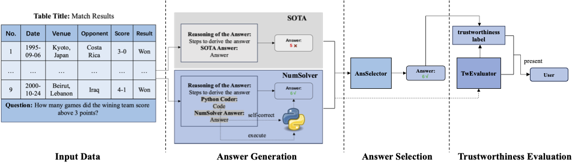

# TabLaP: Numerical Problem Solver for Tabular Question Answering
This project is focused on improving the performance of LLMs for numerical problems and its reliability over tabular data.

Paper link:
https://arxiv.org/pdf/2410.12846
```
@inproceedings{wang2025accurate,
  title={Accurate and regret-aware numerical problem solver for tabular question answering},
  author={Wang, Yuxiang and Qi, Jianzhong and Gan, Junhao},
  booktitle={Proceedings of the AAAI Conference on Artificial Intelligence},
  volume={39},
  number={12},
  pages={12775--12783},
  year={2025}
}
```
## Create Virtual Environment
Create a conda environment named TabLaP 
```
conda env create -f environment.yaml
```

## Python Path
Execute the following command in the TabLaP directory
```
export PYTHONPATH=$(dirname $(pwd)):$PYTHONPATH
```

## Reproducing Experiment Results
To reproduce the experiment results, please follow these steps:
### WTQ dataset
Navigate to the TabLaP directory and run the evaluation scripts
For evaluate NumSolver performance:
```bash
python wtq/evaluate.py
```

For evaluate TabLaP performance:
```bash
python wtq/tablap_eval.py
```

### FTQ dataset
Navigate to the TabLaP directory and run the evaluation script:
For evaluate NumSolver performance:
```bash
python ftq/evaluate.py
```

For evaluate TabLaP performance:
```bash
python ftq/tablap_eval.py
```

### TabFact_small dataset
Navigate to the tabfact directory and the detailed codes are in the "TabFact_small.ipynb" jupyternotebook 
Notes:
The codes for fine-tuning Tapex-large and OmniTab-large using your own datasets are also included in the notebook. Due to the file size limit, the train.jsonl file is uploaded in my shared link (same as the link with model ckpt below).

## Fine-tuning or Inferring by yourself
1. First you need to build up your own training or testing dataset. Your can refer to the scripts named "building_testing_data.py" and "building_training_data.py" in wtq or ftq directories.

2. After obtaining your dataset, for fine-tuing (LoRA), you can try:
```bash
python wtq/model_ft.py
python ftq/model_ft.py
```
For inference, you can try:
```bash
python wtq/inference.py
python ftq/inference.py
```
Besides, we also include our checkpoints for AnsSelector and TwEvaluator in the "example_ckpt" directory (please download using this link: https://drive.google.com/drive/folders/1Ss2ia1NswGZw1xEsHexouS4IU43ojAy6?usp=drive_link).
We share the same AnsSelector and TwEvaluator for both datasets, since the tasks are simialr, however, you can further fine-tuning the modules for specific datasets.

3. If you want to expolore NumSolver alone, you can try:
```bash
python wtq/num_solver.py
python ftq/num_solver.py
```
Note: please set your api_key before running by: 
```bash
export OPENAI_API_KEY="your_key"
```
## Contact
If you have any further questions, please email yuxiang.wang8@student.unimelb.edu.au

